  <h2 align="center">Text2Garment  Text-guided 3D Garment Generation</h2>

## Method

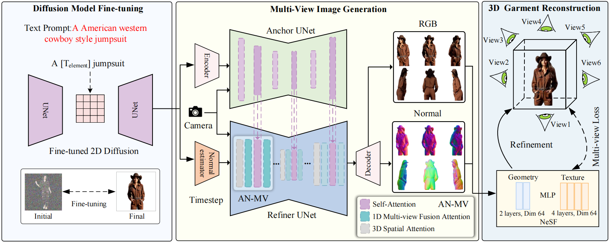

### More results

  

    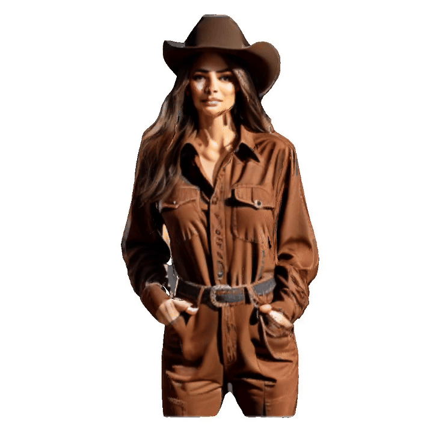
    
An American western cowboy style jumpsuit

  

  

    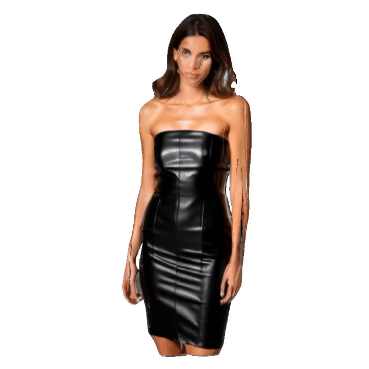
    
A black leather strapless dress

  

  

    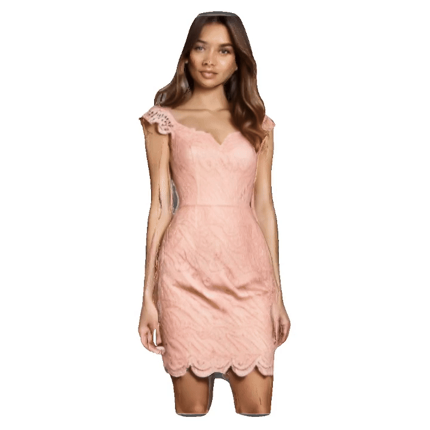
    
A blush-pink lace dress with cap sleeves, a fitted bodice, and a scalloped hem that falls to the mid-calf

  

  

    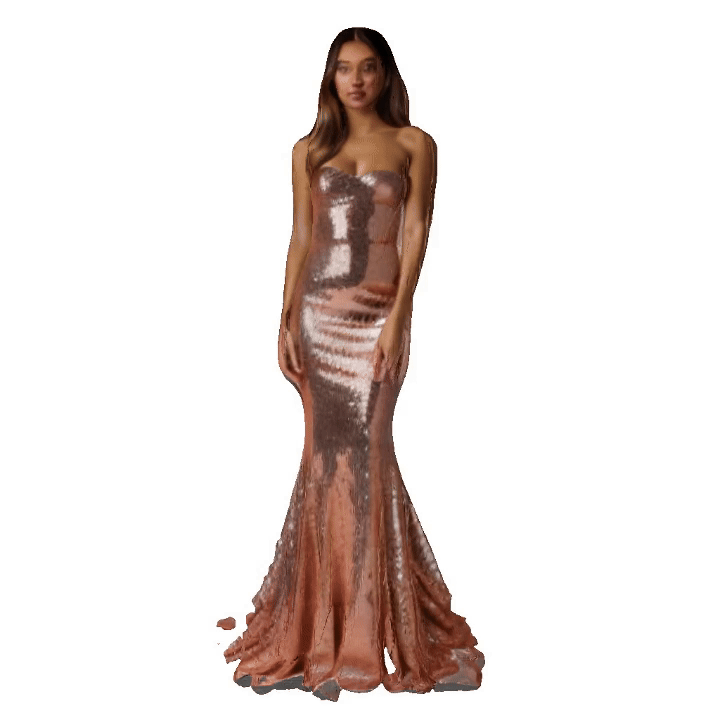
    
A body-hugging, rose-gold sequin dress with a strapless neckline and a floor-length mermaid silhouette

  

  

    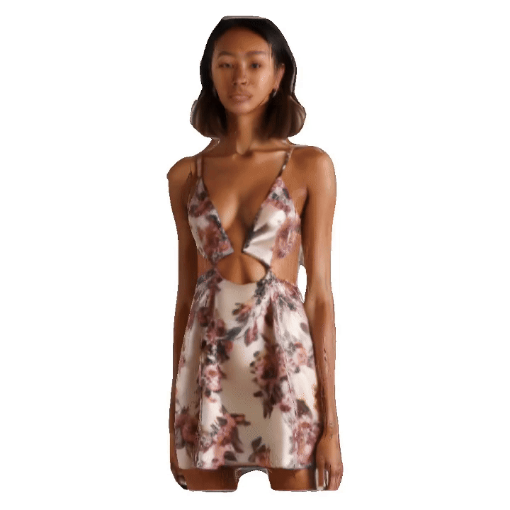
    
A cutout floral-print satin-crepe mini dress

  

  

    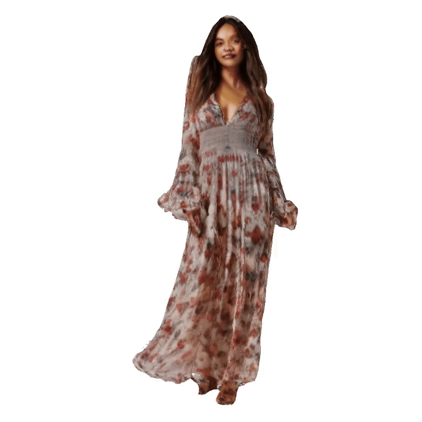
    
A floral-print chiffon maxi dress with long, bell sleeves, a plunging neckline, and a smocked waist for a relaxed fit

  

  

    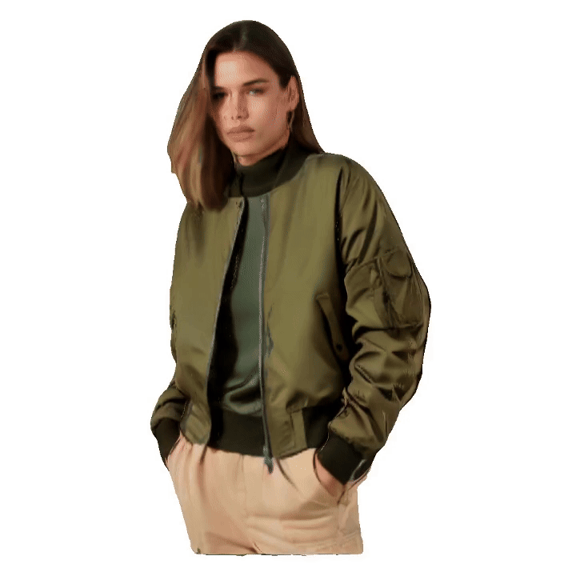
    
An oversized beige sweater and slim-fit shorts

  

  

    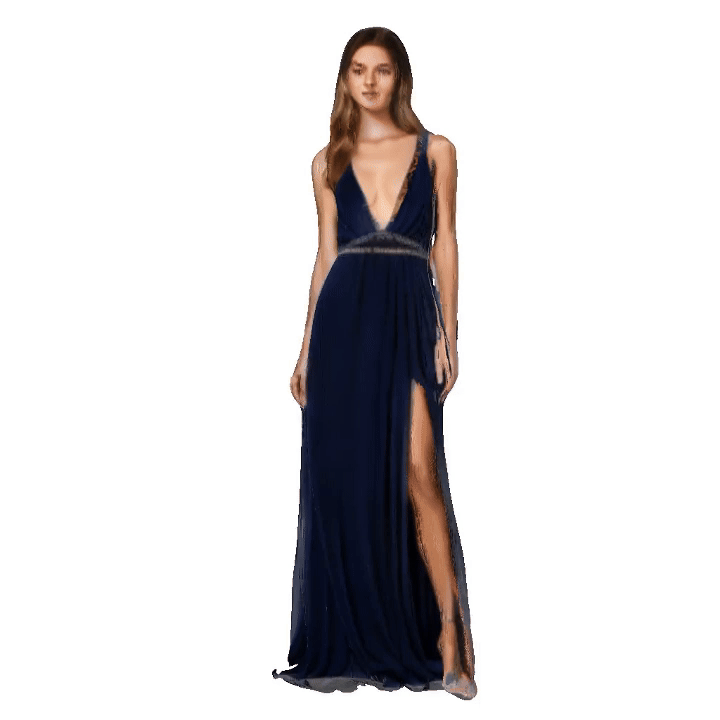
    
A flowing navy-blue silk gown with a deep V-neck, adorned with subtle silver beading and a thigh-high slit

  

  

    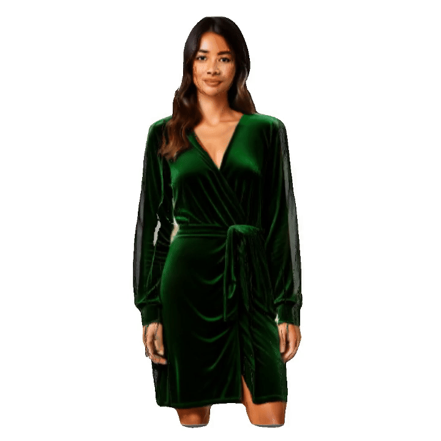
    
A green velvetwrap dress with a knee-lengthhem

  

  

    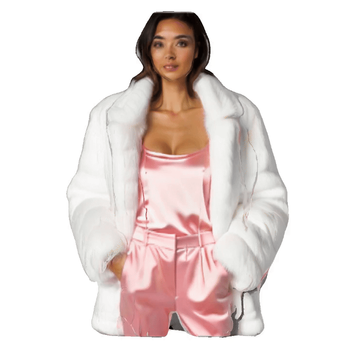
    
A pink satin camisole and white faux fur jacket with matching pants

  

  

    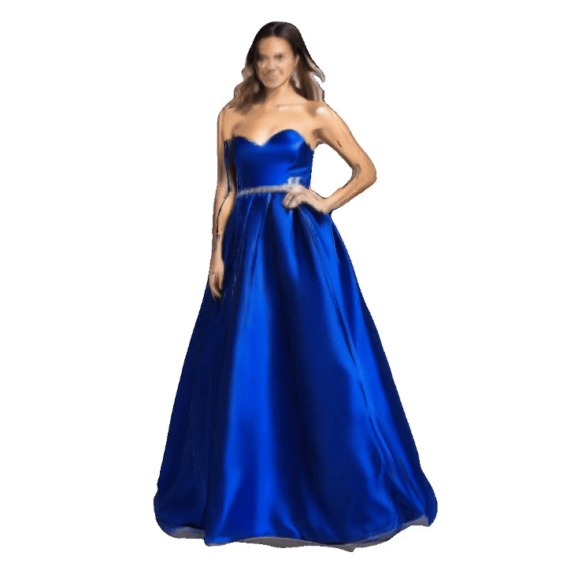
    
A royal blue satin ball gown with a strapless sweetheart neckline, a cinched waist, and a voluminous, floor-length skirt

  

  

    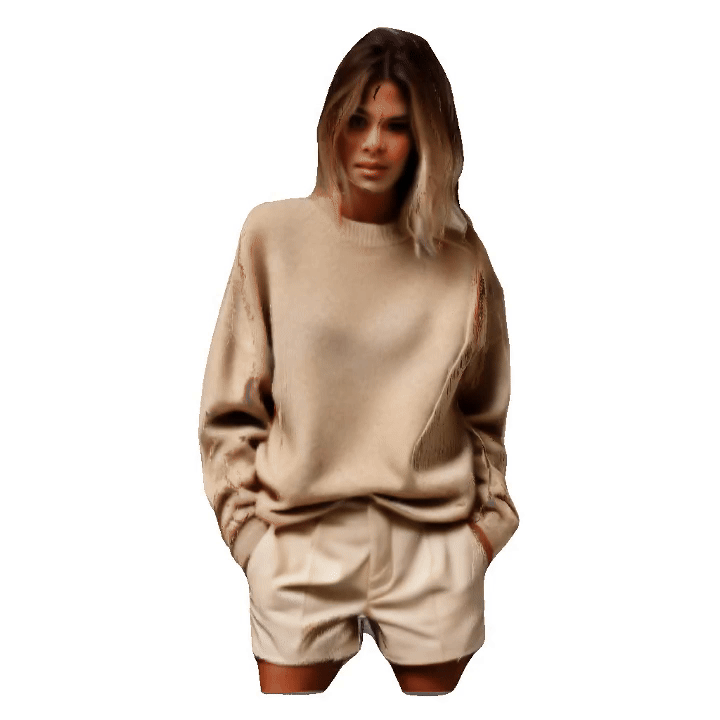
    
An oversized beige sweater and slim-fit shorts

  

​      

​       

​    

​    

​        

